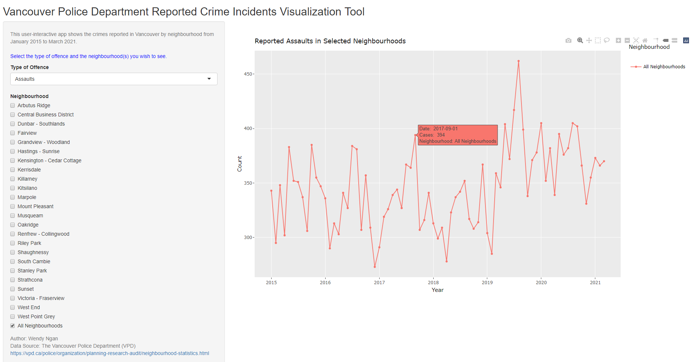
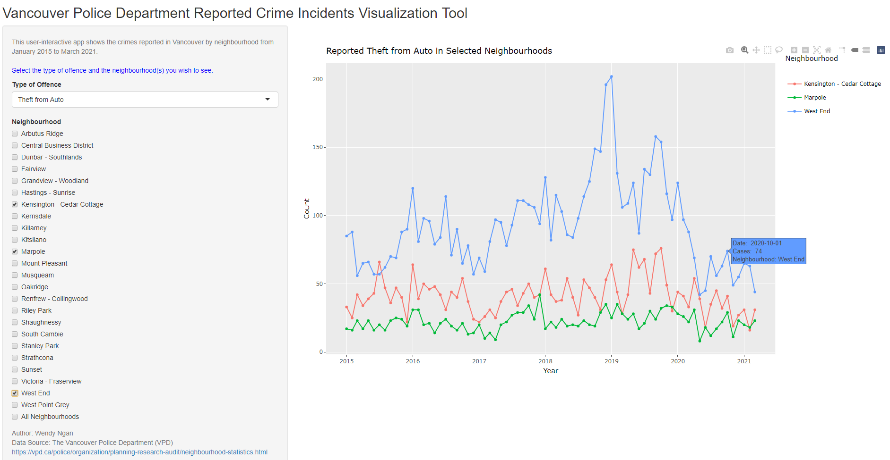

## Vancouver Reported Crime Incidents Visualization Tool

This interactive visualization tool shows the Vancouver Police Department reported crime incidents by neighbourhood.

## Shiny Interface

[Click here](https://wendy-ngan.shinyapps.io/vpd-crime-visual/) to use the tool.

Preview:

## About the Data
Data source is [Vancouver Police Department - Statistical Report by Neighbourhood](https://vpd.ca/police/organization/planning-research-audit/neighbourhood-statistics.html), which is in PDF format and updated monthly on their site. Since the reports are in PDF format, sometimes inconsistent, it makes reading and transforming the data more tricky. This is why the tool is not currently set to update automatically. I will continue to work on this and find a better solution.

## Inspiration
As I was looking to conduct a Vancouver crime rate time series analysis, I realized there wasn't any graphs available to show trends over the years. Hence I decided to make one that allows for one to easily visualize and explore the possible trends in the data.

